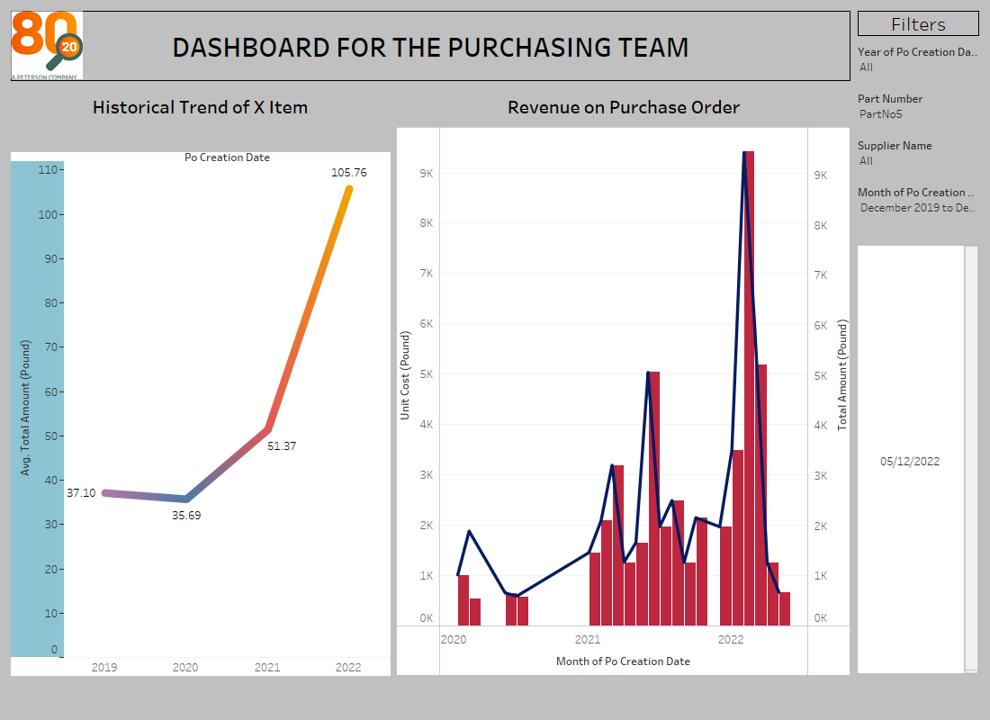
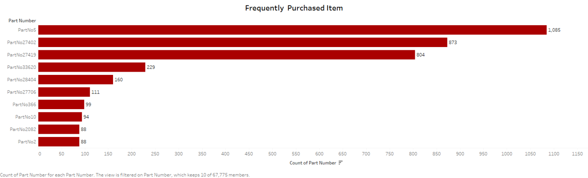

# 8020-Procurement-Product-Analysis

## Introduction 
8020 Procurement Product Analysis project is a data analysis project done with Tableau Desktop to help the company understand more of her products, her supplier, and which products are generating higher returns and more likely to be in demand in the near future based on the current demand.

## Problem Statement: Stakeholders Requirements

Business Manager: Interested in long-term goals such as purchase trends and opportunities.
- What are the items that are frequently purchased, that could be incorporated as stocks?
- Which items are getting more expensive to buy?
- Are all the items being purchased by the best supplier?

Purchase Team: Interested in operational and historical data of prices and suppliers.
- How has the price of X item behaved in the last year?
- Is there a wholesale price available?

## Data Source

## Data Transformation
Data Cleaning
- 4 Datasets are cleaned individually using tableau prep to remove fields, group values, and filtering of columns and range of values.
- Trimming of column spaces

Data Joining
- The 4 datasets were composed of 2 datasets by joining related data points.
- The 2 datasets were union into one and cleaned.

Data Cleaning/Extraction
- The dataset datatypes were inspected and corrected appropriately
- Removing of irrelevant fields was done and the introduction of new fields through calculated fields.
- Complete cleaned data was re-assessed before putting it into final output data use for analysis.

## Dashboard Navigation
Dashboard Navigation
Dashboard user interface and navigation portfolio
- Two dashboards are presented according to stakeholder’s request.
- Filter button is created on each dashboard to filter all charts according to requests

Business Manager                        | Purchasing Team
----------------------------------------|----------------------------------------
 | 

## Analysis Insights
### Frequently Purchased Items
Product Number 5 is recognised to be the most purchased item with a count of 1085 out of the whole company product. Part Number 5 as the most purchased product can be incorporated as stock.

### Items Getting More Expensive to Buy
Out of 8020 Product stock analyses, part number 5 is likewise recognised as an item getting more expensive to buy over the years. The below chart reflects the product price changes over the years from 2019 – 2022 showing quarterly.

### Supplier Performance Based on Delivery for Product Number 5
To understand Product number 5 best supplier, the below chart is split to 3 to Avg. Delivery Time by Supplier, Avg. Unit Cost, and quantity sold by the supplier

### Price Trends for 'X' Items (Product Number 5)
To understand the price changes of Product Number 5, the chart below reflects Avg. Total Amount in Pounds, increment from 2019 – 2022.

### What Supplier is Offering the Best Price

## Skills Demonstrated
- Data analysis
- Data visualisation
- Data cleaning with Tableau Prep Builder etc

Thank you for your time.🤝
